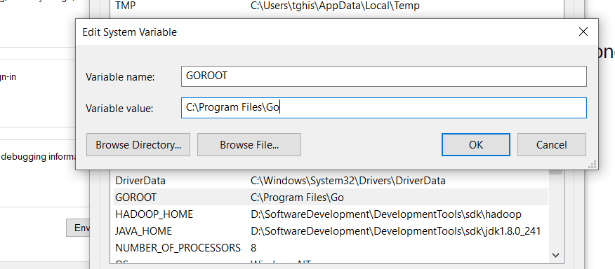
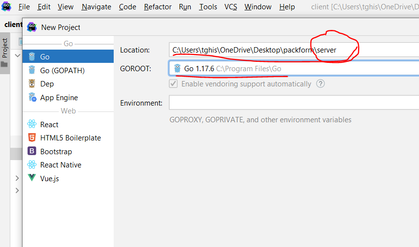
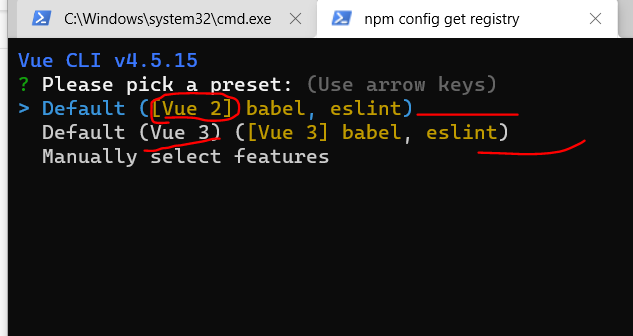
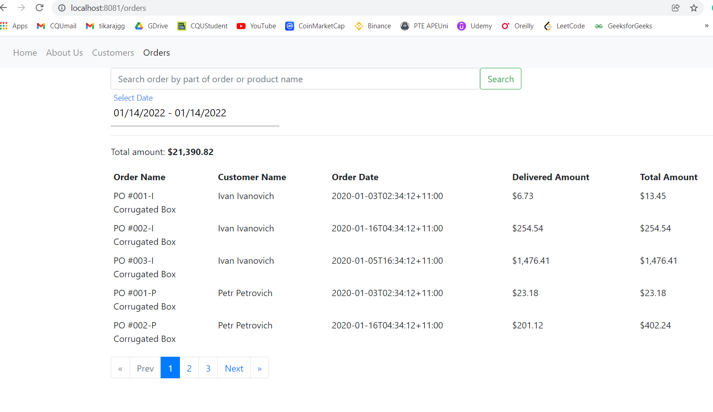
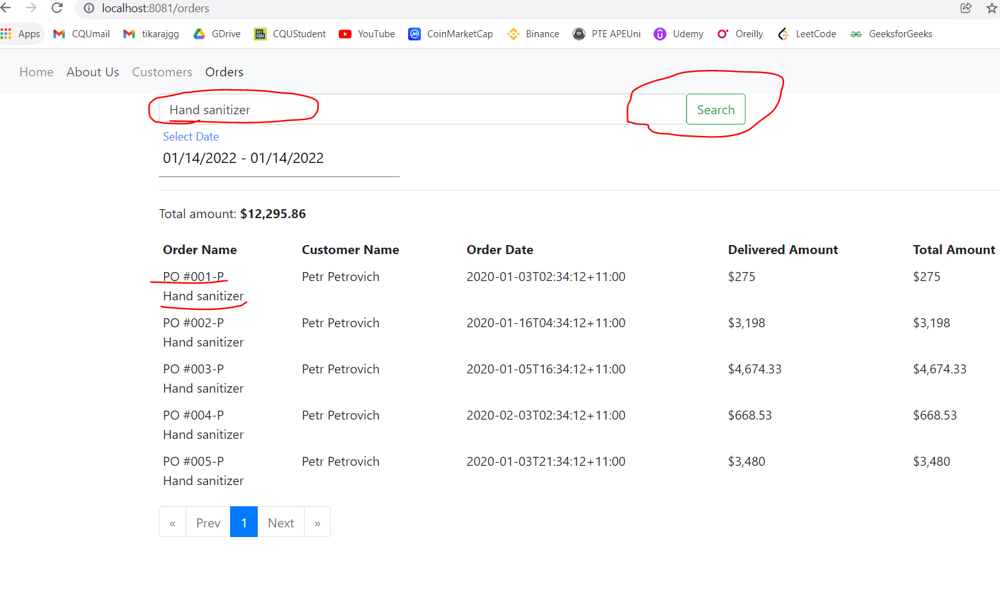

# Order Management System (Backend/REST API: Golang, Frontend: Vue.js, & Database: PostgreSQL)
Order management system using golang (go) backend/RESTAPI, PostgreSQL, and Vue JS frontend 

## Backend using Golang and PostgreSQL DB

## 1. Go/Golang, and IDE for Go setup
1. Download Go/Golang from [https://go.dev/doc/install](https://go.dev/doc/install) and install using given instruction in the website.

2. Create the GOPATH environment variable 

3. 
4. ![screenshots\img.png]

    and Path: C:\Program Files\Go\bin 

5. Use [ATOM with Go-plus](https://atom.io/packages/go-plus) / [VS code](https://code.visualstudio.com/docs/languages/go) / [GoLand](https://www.jetbrains.com/go/) or other IDEs
6. Create go application using GoLand (You can use other IDEs)

7. 
8. Create go program and run the main() method

## 2. PostgreSQL DB setup
1. Download [PostgreSQL](https://www.postgresql.org/download/) from [https://www.postgresql.org/download/](https://www.postgresql.org/download/) and install PostgreSQL server, pgAdmin in your system.
2. Create PostgreSQL database and tables using pgAdmin 

## Front-end using Vue JS

## 1. Node JS setup
1. Download Node JS from [https://nodejs.org/en/download/](https://nodejs.org/en/download/) and install it in your system. The Node Package Manager (npm) is used to install Vue.js
and check the version of installed npm
```
npm --version
```
## 2. Vue.js install
```
npm install vue
```
## 3. Install Vue CLI
```
npm install -g @vue/cli
```
### 4. Create Vue js app from command line
```
vue create your_app_name
```
### 5. Select  Vue version i.e. Vue 2, Vue 3


```
cd your_app_name 
```
### 6. Run the vue app
```
npm run serve 
```

### Order Management System project 
### 1. Technical Instruction
1. Download project from [https://github.com/tghising/order-management](https://github.com/tghising/order-management) from GitHub.
2. You can see two directories i) server for Backend (Golang and PostgreSQL) and ii) client for frontend (Vue.js)
### Backend project (i.e. server directory)
1. Create "order-system" database in PostgreSQL for the project then
2. Go to server directory and Run Go main() method in main.go and it will serve and listen on port: 8090 i.e. [http://localhost:8090/api/orders?page=1&pageSize=5](http://localhost:8090/api/orders?page=1&pageSize=5)

### Frontend project (i.e. client directory)
1. Go to client directory i.e. cd client then run following commands in command line
```
npm install 
```
2. Run the frontend app
```
npm run serve 
```
3. then, go to [http://localhost:8081/orders](http://localhost:8081/orders)

### 2. User Manual
1. User can visit [http://localhost:8081/orders](http://localhost:8081/orders) then user can see 

2. Search by Order Name or Product


## Thanks.